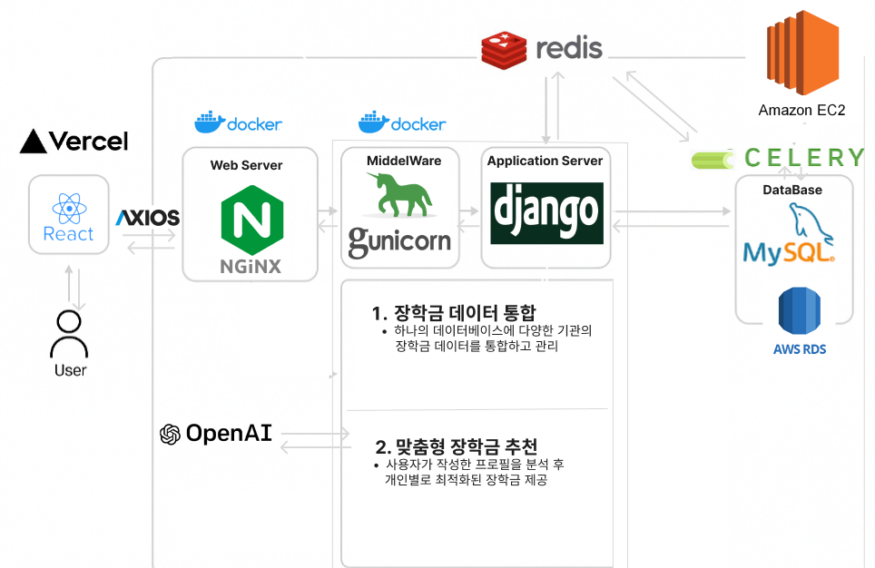
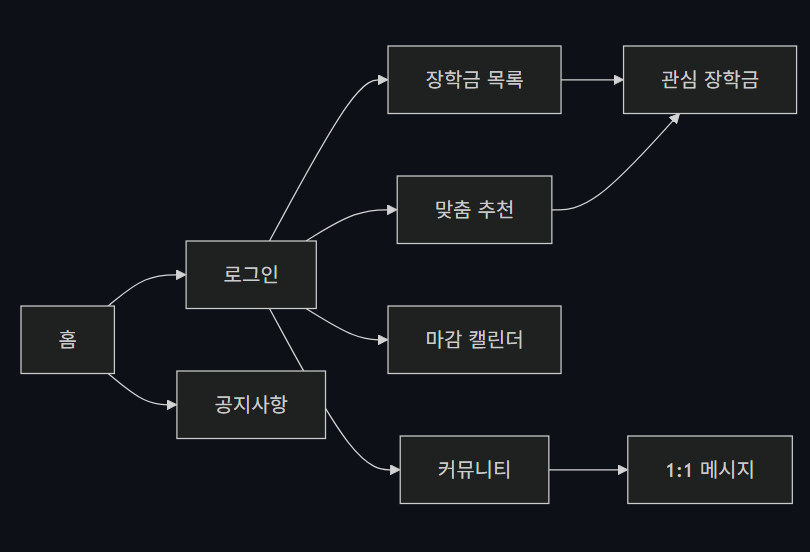

# ScholarMate

> 사용자의 학적, 지역, 소득, 관심 조건을 바탕으로 장학금을 탐색하고 추천받을 수 있는 플랫폼입니다.

ScholarMate는 장학금 정보를 찾고, 비교하고, 마감일을 관리하는 과정을 하나의 흐름으로 묶은 서비스입니다.  
프론트엔드는 장학금 목록 검색, 맞춤 추천, 관심 장학금, 마감 캘린더, 커뮤니티, 공지사항, 1:1 메시지를 담당합니다.

| 구분            | 구현 내용                                                                                |
| --------------- | ---------------------------------------------------------------------------------------- |
| 문제 해결       | 장학금 탐색, 추천 확인, 관심 등록, 마감 관리까지 이어지는 사용자 흐름 구현               |
| 프론트엔드 구조 | 라우트 단위 page와 도메인별 feature 컴포넌트를 분리해 유지보수성 개선                    |
| 서버 상태 관리  | TanStack Query로 목록, 추천, 관심 장학금 데이터를 캐싱하고 무효화 전략 적용              |
| 인증 처리       | JWT access/refresh token 기반 로그인 상태 유지와 401 자동 재시도 처리                    |
| 사용자 경험     | protected route, lazy loading, toast feedback, optimistic update, responsive layout 적용 |
| 품질 관리       | 단위 테스트, 접근성 smoke test, Lighthouse/성능 측정 스크립트 구성                       |

## 프로젝트 배경

장학금 서비스는 사용자가 단순히 목록을 보는 데서 끝나지 않습니다.  
지원 조건을 확인하고, 본인에게 맞는 장학금을 선별하고, 관심 목록에 저장하고, 마감일을 놓치지 않아야 합니다.

이 프로젝트에서는 다음 세 가지를 프론트엔드 목표로 두었습니다.

1. 많은 장학금 데이터를 검색, 필터, 페이지네이션으로 탐색하기 쉽게 만든다.
2. 추천 결과를 상세 정보, 추천 이유, 관심 등록 흐름으로 연결한다.
3. 캘린더, 커뮤니티, 메시지 기능을 통해 서비스 사용성을 확장한다.

## 주요 기능

### 인증

- JWT 로그인, 회원가입, 이메일 인증
- 아이디 찾기, 비밀번호 재설정 모달
- access token 만료 감지와 refresh token 자동 갱신
- 로그인 필요 페이지에 대한 route guard 처리

### 장학금 탐색

- 장학금 목록 검색, 유형 필터, 정렬
- 페이지네이션과 페이지당 표시 개수 변경
- 상세 모달, 외부 홈페이지 링크 정규화
- 관심 장학금 등록/해제 optimistic update

### 맞춤 추천

- 사용자 장학 정보 기반 추천 API 연동
- 추천 카드, 상세 모달, 추천 이유 모달 분리
- 추천 조회 전 사용자 정보 미입력 상태 안내
- 추천 목록과 관심 장학금 상태 동기화

### 캘린더

- 관심 장학금 마감일 캘린더 표시
- 제출 완료 표시와 localStorage 저장
- 마감 알림 등록/취소 API 연동
- 제출 서류 복사와 D-1 알림 toast

### 커뮤니티와 메시지

- 게시글 목록, 검색, 카테고리, 인기순/최신순 정렬
- 게시글 작성, 수정, 삭제, 좋아요, 북마크, 공유
- 댓글, 대댓글, 답글 편집 UI
- 1:1 대화 목록, 메시지 전송, 읽음 처리

### 공지와 홈

- 공지사항 목록/상세, 검색, 페이지네이션
- 홈 화면 최신 공지/커뮤니티 미리보기
- WebP 이미지 자산 적용과 hero/card 이미지 최적화

## 기술 스택

| 영역         | 기술                                           |
| ------------ | ---------------------------------------------- |
| Core         | React 18, Vite 6, JavaScript                   |
| Routing      | React Router                                   |
| Server State | TanStack Query                                 |
| Client State | Redux Toolkit, React Redux                     |
| API          | Axios                                          |
| UI           | CSS, Tailwind CSS, Ant Design, React Icons     |
| Test/QA      | Node test runner, ESLint, axe-core, Lighthouse |
| Deploy       | Vercel, Vite production build                  |

## 시스템 아키텍처



## 설계와 구현 의사결정

### 1. feature 중심 구조

페이지 컴포넌트에 UI와 비즈니스 로직이 과도하게 모이는 문제를 줄이기 위해 도메인별 feature 폴더를 분리했습니다.

```text
src/
  api/                 API 클라이언트와 도메인별 요청 함수
  app/                 Redux store
  components/          공통 컴포넌트와 홈 섹션
  features/            auth, calendar, community, recommendations, scholarships, userInfo
  pages/               라우트 단위 페이지
  shared/              공통 hook, query client, query key, utility
```

이 구조로 `pages`는 화면 조립과 라우팅 중심 역할을 맡고, 세부 UI와 유틸리티는 `features`와 `shared`에서 관리합니다.

### 2. 서버 상태와 클라이언트 상태 분리

- 서버에서 가져오는 장학금, 추천, 관심 목록은 TanStack Query로 관리합니다.
- 로그인 여부와 인증 확인 상태는 Redux Toolkit slice로 관리합니다.
- `queryKeys`를 중앙화해 캐시 키 중복과 무효화 실수를 줄였습니다.

### 3. JWT 자동 갱신 흐름

`src/api/axios.js`의 공통 Axios 인스턴스에서 다음 처리를 담당합니다.

- 요청 전 access token 만료 여부 확인
- refresh token으로 access token 재발급
- 동시 요청 시 refresh 요청을 1회로 제한
- 401 응답 발생 시 한 번만 재시도
- 인증 복구 실패 시 토큰 제거 후 로그인 페이지로 이동

### 4. 사용자 피드백과 실패 복구

- 관심 장학금, 좋아요, 북마크는 즉시 UI에 반영하고 실패 시 이전 상태로 복구합니다.
- 주요 액션은 toast로 성공/실패 상태를 전달합니다.
- 추천 조건 미입력, 세션 만료, 빈 검색 결과 같은 예외 상태를 화면에서 분기 처리합니다.

### 5. 품질 검증 자동화

단순 빌드 확인에 그치지 않고, 기능·접근성·성능을 자동으로 검증할 수 있는 테스트 환경을 구성했습니다.

- 단위 테스트: 날짜 계산, 페이지네이션, 추천 이유 파싱, URL 정규화, 사용자 정보 payload 변환
- 접근성 smoke test: 이미지 alt, 외부 링크 noopener, 로그인 autocomplete, 주요 landmark 확인
- E2E/접근성 테스트: production build를 로컬 정적 서버에서 실행하고 Chrome DevTools Protocol과 axe-core로 검증
- Lighthouse/성능 테스트: 홈 화면의 desktop/mobile 환경을 기준으로 성능, 접근성, SEO, Best Practices 측정

## 화면 흐름



## 주요 라우트

| 경로                                     | 화면                 |
| ---------------------------------------- | -------------------- |
| `/`                                      | 홈                   |
| `/login`, `/register`                    | 로그인, 회원가입     |
| `/scholarships`                          | 장학금 목록          |
| `/recommendation`                        | 맞춤 장학금 추천     |
| `/interest`                              | 관심 장학금          |
| `/calendar`                              | 장학금 마감 캘린더   |
| `/userinfor`                             | 나의 장학 정보 입력  |
| `/community`, `/community/:id`           | 커뮤니티 목록과 상세 |
| `/notice`, `/notice/:id`                 | 공지사항 목록과 상세 |
| `/messages`, `/messages/:conversationId` | 메시지 목록과 대화   |
| `/profile`                               | 사용자 프로필        |
| `/introduction`                          | 서비스 소개          |

## 검증 결과

최종 확인 기준으로 다음 명령이 통과했습니다.

```bash
npm test
npm run lint
npm run build
```
